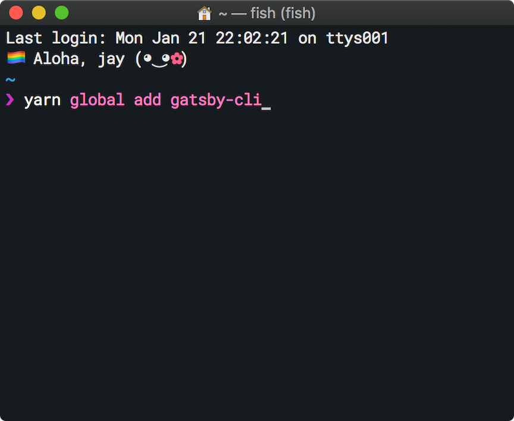
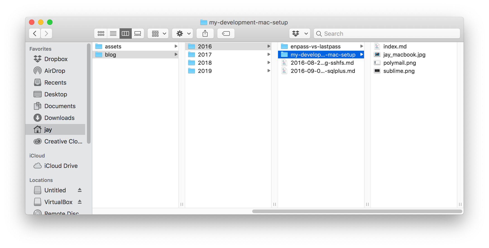
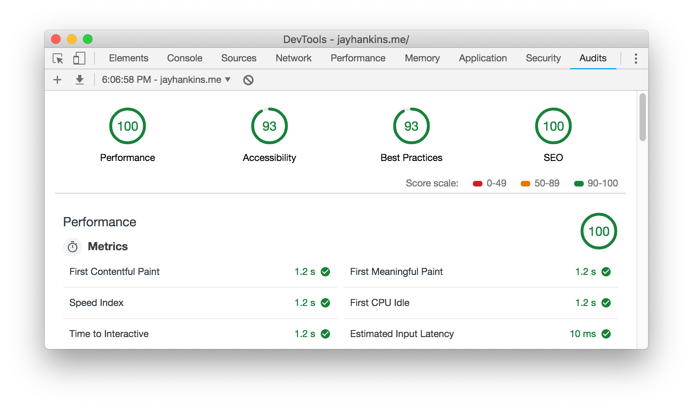

For a while now I've been wanting to migrate my blog from [Jekyll](https://jekyllrb.com/) to something JS-based. This is for a few different reasons:

- I'm much more comfortable with the JS ecosystem than the Ruby ecosystem. When Jekyll or Ruby breaks, I don't know how to fix it.
- Having to troubleshoot and debug those problems discourages me from blogging, and I want to make this a frictionless experience.
- I love React and the power it gives me when working on the frontend.

I didn't want to have a CMS or other non-static site. Static sites are so easy
and cheap to serve that it's not worth the headaches that come with the upkeep
of dynamic CMSes. However, all the JS web apps I built beforehand were frontends
that pulled data from APIs. I didn't really have enough knowledge of JS and its
build systems to know how to coerce a web app into reading [Markdown](https://daringfireball.net/projects/markdown/)
files from my local filesystem, I thought there would be difficult limitations
with trying to host on GitHub Pages.

I thought I was gonna have to learn all the ins and outs of Server-Side
Rendering (SSR). Much to my delight, [Gatsby](https://gatsbyjs.org/) made
setting up a JS-based blog with Markdown files for posts **so easy**. Here's
how I did it.

## Install Gatsby and Create a Project

1. Install Gatsby's CLI tool:

        $ yarn global add gatsby-cli

2. Create a new Gatsby project site using the [starter blog template](https://github.com/gatsbyjs/gatsby-starter-blog):

        $ gatsby new my-blog-starter https://github.com/gatsbyjs/gatsby-starter-blog

3. Run the project:

        $ gatsby develop

There we go. Now the Gatsby dev server is running. The dev server gives us cool
features, like keeping code maps so we can debug easier, as well as
hot-reloading, so you don't need to refresh your browser to see your changes. A
quick visit to [localhost:8000](http://localhost:8000) will show you the running
project!

A quick reminder that when developing locally, you should make sure to disable
your cache. Gatsby makes an effort to disable caching, but I still had trouble
with cached assets every so often. A good Shift + refresh will make sure you see
the latest changes. You can also pop open your browser dev tools and tick the
"disable cache" option.

## How to Create Posts

Remember how I was worried about being able to parse Markdown files from my
local filesystem? Well that was pretty unfounded of me, because the blog starter
project has made it really easy.

Blog posts live in `content/blog/`, and from there you can pick any type of
structure you like. (That's another plus of Gatsby: it's just as easy to edit as
any old React site.) Here's how I've organized my blog:

Example: Here's an example directory layout for a post with images.

I have directories for each year. Inside each year directory is either a folder
with the slug name of the post, e.g. `enpass-vs-lastpass/`, or a `.md` file.

If the post is text-only, I create a Markdown file with `slug-name.md` as the
name. If the post contains images or other reference files, I create a folder
with the `slug-name` instead.

The associated files go in there, along with an `index.md` which is the post
content. With both approaches, you'll get permalink URLs matching the structure
you choose. In my case, I get: `https://jayhankins/2016/enpass-vs-lastpass/`.

## Migrating Old Posts

In the case of Jekyll blogs, posts are written mostly in Markdown, perhaps with
some embedded HTML tags. It was easy enough to just copy over my directory
structure from the old blog's repo to the new one. BUT. It's not enough to just
move the files over. Unless your frontmatter\* matches exactly, you'll find some
wonky things.

*Frontmatter is the contents at the top of a post file that contains metadata
about the post, such as the date it created, the date it was updated, title,
description, tags, etc.

First off, your dates might not be in the right format. I found that Gatsby
wouldn't be able to compile the site if dates were formatted incorrectly. Bad
news, I was using a date format that was compatible with Ruby but not JS. I'm
not knowledgeable enough about timestamp formats, and I don't really care that
much, so I just converted them to the JSON-type date format that I use elsewhere
in JS (yay!):

    # JS date format

    date: '2016-08-14T22:40:32.168Z'

Basically, it's `Year-Month-Day` + `T` (for time) + `Hours:Mins:Seconds.Fraction` + `<timezone num>` + `Z`. (Pacific Daylight is -7Z. Eastern Standard is -5.)

Second, you might have other frontmatter problems. Make sure that the fields
match what you're expecting to pull into your Gatsby site. How do you know what
Gatsby is pulling in? Enter GraphQL.

## Understanding GraphQL in Gatsby

[GraphQL](https://graphql.org/) is great and useful for so much more than static
site generators. I think it's the future of web APIs, because it solves so many
headaches on the frontend when dealing with data that isn't well-formed.
Regardless, GraphQL is also the mechanism by which the content from your post
Markdown files is queried.

Since we want to know what fields are being loaded from the posts' frontmatters
into Gatsby, we need to know what the GraphQL query is.

If you look at `src/index.js` you will see a `pageQuery` variable which is a
string written in GraphQL syntax to select posts. Here's an example of mine:

    // index.js

    ...
    // This query gets the site title and posts in descending date order.
    // From each post, it gets the date, title, and published fields from the frontmatter.
    export const pageQuery = graphql`
      query {
        site {
          siteMetadata {
            title
          }
        }
        allMarkdownRemark(sort: { fields: [frontmatter___date], order: DESC }) {
          edges {
            node {
              excerpt
              fields {
                slug
              }
              frontmatter {
                date(formatString: "MMMM DD, YYYY")
                title
                published
              }
            }
          }
        }
      }
    `;

Now you can match up the frontmatter in your Markdown files with what Gatsby
expects. There are also queries in `src/Bio.js`, `src/seo.js`,
`src/blog-post.js` and `404.js`. Be sure to check them out. Make as many
modifications as you need. Whatever modifications you make to frontmatter and
`index.js`, you will also need to make in `blog-post.js`, which is the file that
renders individual posts. Make as many modifications as you need.

## Customizing the Font

I think the default theme looks really good out of the box, but I wanted to
change the font family. Gatsby blog starter is using
[Typography.js](https://kyleamathews.github.io/typography.js/) to customize
typography across our site. In the file `src/utils/typography.js`, you can see
that the default theme is Wordpress2016. There are also some overrides. You can
see my `typography.js` in this repo, but I opted for a system font stack coupled
with the defaults from Wordpress2016:

    // src/utils/typography.js

    ...
    const systemFontStack = ['-apple-system', 'BlinkMacSystemFont', "Segoe UI", 'Roboto', "Helvetica Neue", 'Arial', "Noto Sans", 'sans-serif', "Apple Color Emoji", "Segoe UI Emoji", "Segoe UI Symbol", "Noto Color Emoji", '!default'];
    ...
    Wordpress2016.headerFontFamily = systemFontStack;
    Wordpress2016.bodyFontFamily = systemFontStack;
    ...

When using a system font stack, make sure you include the emoji fonts to get the
best emoji display across different browsers and systems. On my machine, Firefox
and Chrome would opt to show Unicode characters instead of emojis, and adding
the various emoji fonts to the `systemFontStack` solved this issue.

## Syntax Highlighting with Prism

There's a Gatsby
[plugin](https://www.gatsbyjs.org/packages/gatsby-remark-prismjs/) for
highlighting code blocks in your posts (just like this one!). To make it work, I
had to install the Prism plugin for Gatsby, as well as import a prismjs theme
into `gatsby-browser.js`. I'm confident that the docs for both Prism and the
Gatsby plugin are sufficient to get you up and running.

## Deploy it to GitHub Pages

This was my big question. "How on earth to deploy it to GitHub Pages?" It's
easy. Build your site with Gatsby, then push it up with the
[gh-pages](https://www.npmjs.com/package/gh-pages) npm module. The
[directions](https://www.gatsbyjs.org/docs/how-gatsby-works-with-github-pages/)
change slightly depending on if you're using an organization URL or a repo URL.
The docs can help you identify which command you should use.

I added a script to my `package.json` to help make deploys easy:

    // package.json
    ...
    "scripts": {
       ...
        "deploy": "gatsby build && gh-pages -d public -b master"
      }
    ...

Note: I had a couple of issues again around caching when building my site and
pushing out changes. You can make sure that you have completely removed stale
data locally by running `rm -r .cache public` in your project folder. Then run
`gatsby build` or `yarn deploy` again.

## How Does it Perform?

Another area of concern when it comes to JavaScript web apps is performance. You
want to keep sites small and lightweight for your users' time and bandwidth. I'm
by no means a performance expert, but I ran a Lighthouse audit. Serving my site
from GitHub Pages with a default `gatsby build` resulted in the following
performance metrics:

I was really excited to see this high level of performance right out of the box
with Gatsby. I didn't have to think about anything complicated to get these
scores. Truly, I just pushed it up to GitHub and Gatsby does the rest.

## Todo

Like any good project, there's a lot I still want to explore with this site.
I've already added light/dark (day/night) mode to the site using React Context,
and a way to exclude draft posts from the final site build while still showing
them when developing. Posts on both are coming soon.

An RSS feed is also in the works. It works out of the box with this blog
starter, but I want to make a couple modifications before enabling it on my
site. I'll also add tag pages and probably per-post themes at some point. And...
serverless functions? Let's see. I'm excited. JS and the web is dope!

On the dev side, I need to integrate ESLint and Prettier and VS Code so that
files get cleaned up as I make edits. I also want to set up CI/CD and stop
building on my local machine. Stay tuned if you're interested.

I'd also like to explore using different backends for storing the posts. Gatsby
supports a handful of interchangeable backends (including Google Sheets 😮) and
it would be cool to compare those novel approaches to the simple Markdown file
approach that I know and love. Perhaps in the future, I'll be able to have my
Gatsby blog pull right from a [Notion.so](http://notion.so) database. (I hope!)

That's about it... hope you enjoyed this quick intro to blogging with Gatsby.
Reach out on Twitter to discuss more!
